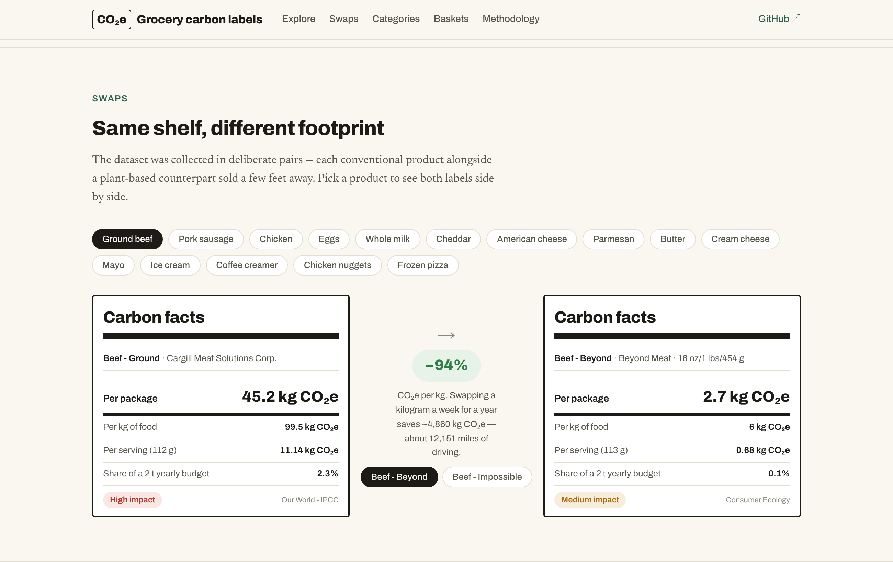

# Grocery carbon labels

**What if groceries had carbon labels?** Food is responsible for roughly a quarter of global greenhouse-gas emissions, but the climate cost of what lands in a shopping cart is invisible at the shelf. This project takes 76 real products from USDA FoodData Central, matches each to a documented CO₂e intensity estimate, and prints the label the package never had.

### [→ View the live site](https://njsuthe.github.io/GhGlabeling/)



---

## What's here

An interactive site that lets you:

- **Explore** all 76 products as searchable, filterable "Carbon facts" labels — a nutrition-facts pastiche showing CO₂e per package, per kg, and per serving.
- **Compare swaps** — each conventional product next to the plant-based counterpart sold a few feet away (ground beef → Beyond is −94% per kg).
- **See the categories** — how food groups rank on GHG intensity (Poore & Nemecek), and which supply-chain stage the emissions actually come from.
- **Add up baskets** — three shopper profiles extrapolated to weekly, monthly, and annual footprints.
- **Read the methodology** — every assumption, caveat, and source, with the citation printed on each label.

## Two versions

This project was first built by hand, then rebuilt — and the history is kept on purpose.

| Version | Presentation | Where |
|---|---|---|
| **v1 (2024)** | Tableau storyboard, assembled manually | [`v1-tableau` release](https://github.com/njsuthe/GhGlabeling/releases/tag/v1-tableau) · PDF in [`legacy/`](legacy/) |
| **v2 (2026)** | Interactive site (Vite + React) | [`site/`](site/) · [live](https://njsuthe.github.io/GhGlabeling/) |

Both draw on the **same** notebook-prepared, hand-enriched dataset. Only the presentation layer changed.

## Repository layout

```
notebooks/   Data-prep notebook: USDA pull, cleaning, CO₂e enrichment, basket math
data/        Source + derived CSVs (raw pull, cleaned, hand-enriched, OWID references)
site/        v2 interactive site (Vite + React), deployed to GitHub Pages
legacy/      v1 Tableau storyboard (PDF export)
```

## Running it locally

### The site

```bash
cd site
npm install
npm run dev          # http://localhost:5173/GhGlabeling/
```

The site reads pre-generated JSON in `site/src/data/`. To regenerate it from the CSVs:

```bash
npm run prepare-data
```

### The notebook

The notebook only needs to be re-run to refresh the USDA pull; the enriched CSVs are already committed.

```bash
python3 -m venv .venv
source .venv/bin/activate
pip install -r requirements.txt

cp .env.example .env     # then add your free USDA key (see below)
jupyter lab              # open notebooks/Grocery_Item_GhG_Labeling.ipynb
```

Get a free [FoodData Central API key](https://fdc.nal.usda.gov/api-key-signup.html) and put it in `.env` as `FDC_API_KEY=...`. The notebook loads it automatically via `python-dotenv`; `.env` is gitignored.

## Data & methodology

Product metadata (name, brand, package weight, serving size) comes from the **USDA FoodData Central API** — 76 branded items hand-picked across high- and low-impact food groups, in deliberate conventional/plant-based pairs. Each is matched to a documented greenhouse-gas intensity (kg CO₂e per kg of food), preferring peer-reviewed syntheses and falling back to industry databases where needed. Per-package figures are intensity × package weight.

**Sources**

- Poore, J., & Nemecek, T. (2018). [Reducing food's environmental impacts through producers and consumers](https://www.science.org/doi/10.1126/science.aaq0216). *Science* — primary intensity data, via [Our World in Data](https://ourworldindata.org/environmental-impacts-of-food).
- [CarbonCloud ClimateHub](https://apps.carboncloud.com/climatehub/) — secondary product/category footprints.
- Gap-fillers: [Consumer Ecology](https://consumerecology.com/) (alternative beef), [Bianchi et al. 2021](https://link.springer.com/article/10.1007/s11367-020-01817-6) (chocolate), [HEALabel](https://www.healabel.com/) (nuts), [Eat Just](https://www.ju.st/learn) (plant-based egg).
- Real-world precedent: [Oatly's climate-footprint labels](https://www.bloomberg.com/news/articles/2023-01-31/oatly-launches-climate-footprint-labels-in-the-us).

**Caveats** — Category-level intensities mask brand and supply-chain variability; estimates are sensitive to serving-size and weight assumptions; some products use documented proxies. The goal is comparative guidance for shoppers, not exact carbon accounting.

## Credits

Built by [Nicholas Sutherland](https://www.linkedin.com/in/nicholasjsutherland/). Data from USDA FoodData Central, Our World in Data, CarbonCloud, and the sources cited above. For educational and exploratory purposes; please credit the underlying data providers where used.
